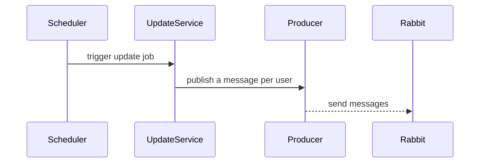
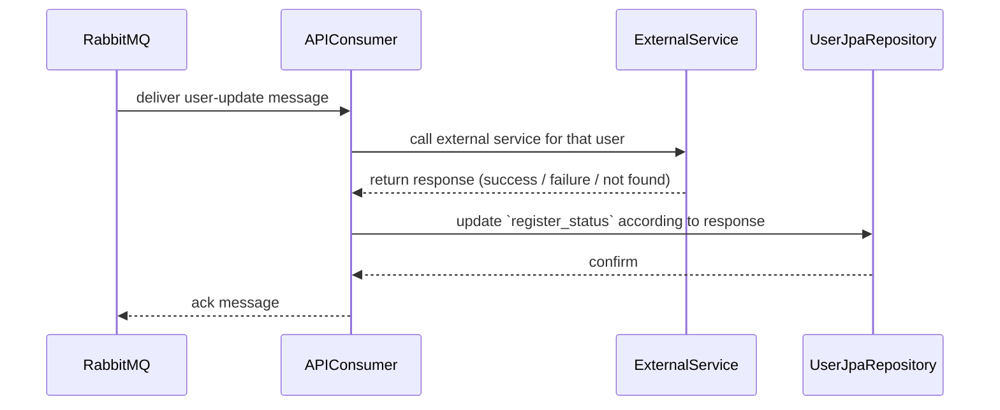

# Updater

This repository contains the Updater microservice — a small Spring Boot application that periodically fetches external user data, produces messages to a message broker and consumes them to update local user records.
**About**

- **Repository:** Updater Spring Boot microservice.
- **Language:** Java 21
- **Build:** Maven

**Usage Technologies (stack)**
- **Java:** 21
- **Framework:** Spring Boot (web, data-jpa, amqp)
- **Messaging:** RabbitMQ (via `spring-boot-starter-amqp`)
- **Database:** H2 in-memory (development, console available)
- **HTTP client:** internal external-client implementation calling external REST APIs
- **Scheduling:** Spring scheduling for periodic update jobs
- **Build tool:** Maven (wrapper included)
- **Utilities:** Lombok (annotation processor)

**Purpose**
The service's goal is to keep local user information synchronized with an external service (configured under `spring.clients.external-service`). It does this by scheduling fetch/update tasks and by using a message-driven architecture to perform updates reliably and decouple components.

**Flow**
High-level flow (summary):

- The **scheduler** is the sole trigger for updates and invokes the update service.
- For each user, the update service publishes a message to RabbitMQ (one message per user).
- The **API** component in this application consumes messages from RabbitMQ, calls the external service, and evaluates the response.
- Based on the external service response the application updates the user's `register_status` accordingly.
Key implementation files:

- `UserController`: [src/main/java/br/com/rafamoura/updater/application/user/controller/UserController.java](src/main/java/br/com/rafamoura/updater/application/user/controller/UserController.java#L1-L200)
- Scheduler: [src/main/java/br/com/rafamoura/updater/application/user/scheduler/UpdateUserSchedulerImpl.java](src/main/java/br/com/rafamoura/updater/application/user/scheduler/UpdateUserSchedulerImpl.java#L1-L200)
- External client: [src/main/java/br/com/rafamoura/updater/infrastructure/user/clients/ExternalClientImpl.java](src/main/java/br/com/rafamoura/updater/infrastructure/user/clients/ExternalClientImpl.java#L1-L200)
- Service: [src/main/java/br/com/rafamoura/updater/domain/user/service/UserServiceImpl.java](src/main/java/br/com/rafamoura/updater/domain/user/service/UserServiceImpl.java#L1-L200)
- Repository: [src/main/java/br/com/rafamoura/updater/infrastructure/user/repository/UserJpaRepository.java](src/main/java/br/com/rafamoura/updater/infrastructure/user/repository/UserJpaRepository.java#L1-L200)
**Technical cases**

- External service unreachable: the external client calls should handle timeouts and return a clear error; the service should log and skip or retry according to configured retry policies.
- Invalid or missing external data: the system should validate external payloads and avoid corrupting local records; invalid responses are logged and ignored.
- Message broker down: message production should fail fast and surface errors; consider a dead-letter queue and retry strategy in production.
- Concurrent scheduler runs: scheduler should be idempotent at the service level to avoid conflicting updates when multiple instances run.
- Database constraint violations: repository operations should surface errors and be handled in consumers to avoid message loss (use retries or DLQ).

Scheduler -> publish flow (detailed):



Message consumption and external-call flow (detailed):



**How to run (local development)**

1. Start RabbitMQ (docker-compose includes a definition):

```bash
docker-compose up -d
```

2. Start the application (Linux/macOS):

```bash
./mvnw spring-boot:run
```

On Windows (powershell/cmd):

```powershell
mvnw.cmd spring-boot:run
```

3. H2 console is available at `http://localhost:8080/h2-console` (configured path `/h2-console`).

**Configuration**

- Main configuration is in `src/main/resources/application.yml` (datasource, rabbitmq, external client base URL).

**Next steps / Suggestions**

- Add integration tests that run with an embedded RabbitMQ (testcontainer) and H2 to validate end-to-end flows.
- Add dead-letter exchange/queue and retry strategy for message processing.
- Add metrics, health checks and observability for production readiness.

----

If you'd like, I can also add example curl commands, a quick architecture diagram file, or commit these changes for you. Which would you prefer next?
